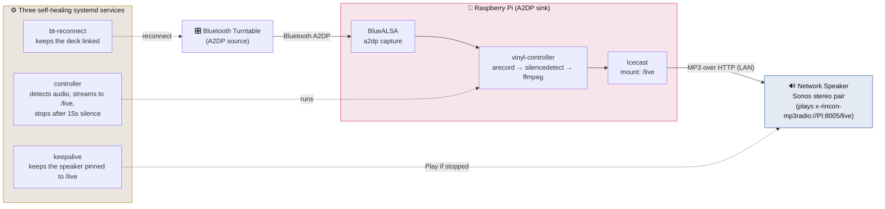

# 🎶 vinylcast

**Bluetooth turntable → Raspberry Pi → your network speakers, automatically.**

Drop the needle and your record plays over your Sonos (or any UPnP/network
speaker) — no phone, no app, no button. Lift the needle to flip the record and
after a few seconds it politely stops. Everything stays **on your LAN**; your
vinyl never leaves the house.

A Bluetooth turntable pairs to a Raspberry Pi acting as an A2DP audio sink. The
Pi watches for real audio, and the moment a record starts it streams the
turntable to a local Icecast mount. Your speaker sits permanently "tuned" to
that stream, so the audio just appears. Three tiny always-on services make the
whole thing self-healing across drops, reboots, and hiccups.

---

## How it works



**The flow, step by step:**

1. The turntable is paired + **trusted** to the Pi over Bluetooth (A2DP). It
   shows up on the Pi as a **BlueALSA** capture device.
2. **`vinyl-controller`** reads that capture with `arecord` and watches the peak
   level. Silence → it idles. Real audio → it fires up **one** `ffmpeg` process
   that encodes the turntable to MP3 and pushes it to the local **Icecast**
   `/live` mount. When it sees `SILENCE_SEC` (default 15s) of continuous silence
   — enough to flip a record — it stops, and the mount falls back to silence (or
   an optional fallback source you configure separately).
3. Your speaker is permanently pointed at `http://PI_IP:8005/live`. Since it's
   always "listening" to that mount, your vinyl comes through the instant the
   controller starts pushing it.
4. **`keepalive`** babysits the speaker: network radio streams stop themselves
   after any hiccup and won't auto-resume, so this re-issues *Play* whenever the
   speaker goes idle. **`bt-reconnect`** does the same for the Bluetooth link.

---

## Requirements

- **Raspberry Pi** (any with Bluetooth; a Pi 3/4/Zero 2 W is plenty) running a
  Debian-based OS (Raspberry Pi OS).
- A **Bluetooth turntable** (or any Bluetooth A2DP audio source).
- A **network speaker.** Tested with a **Sonos** stereo pair. In principle any
  speaker that plays an Icecast/SHOUTcast MP3 URL works — see
  [Other speakers](#other-speakers).
- Packages:
  ```bash
  sudo apt update
  sudo apt install -y bluez bluez-alsa-utils alsa-utils ffmpeg icecast2 python3
  ```
  (On some distros the BlueALSA package is `bluealsa` instead of
  `bluez-alsa-utils`.)

---

## Setup

### 1. Pair and **trust** the turntable

Trusting is the part everyone forgets — an untrusted device won't auto-reconnect.

```bash
bluetoothctl
[bluetooth]# power on
[bluetooth]# agent on
[bluetooth]# scan on          # put the turntable in pairing mode, find its MAC
[bluetooth]# pair  AA:BB:CC:DD:EE:FF
[bluetooth]# trust AA:BB:CC:DD:EE:FF
[bluetooth]# connect AA:BB:CC:DD:EE:FF
[bluetooth]# quit
```

Confirm audio is arriving:
```bash
bluealsa-aplay -L        # you should see your turntable as a capture device
```

### 2. Configure Icecast

Edit `/etc/icecast2/icecast.xml`: set `<listen-socket><port>` to `8005`, and set
a `<source-password>` (you'll put the same value in the vinylcast config). Then:
```bash
sudo systemctl enable --now icecast2
```

> **Optional fallback:** if you want the `/live` mount to play something (a web
> radio station, a playlist) whenever no record is spinning, run a second source
> that streams to a fallback mount and set `<fallback-mount>/fallback</fallback-mount>`
> with `<fallback-override>1</fallback-override>` on `/live` in `icecast.xml`.
> Without this, the mount is simply silent between records.

### 3. Install vinylcast

```bash
git clone https://github.com/tsali/vinylcast.git
cd vinylcast
sudo ./install.sh
sudo nano /etc/vinylcast/config.env      # fill in your values
```

Key settings in `config.env`: your turntable's `BT_MAC`, this Pi's `PI_IP`, the
Icecast `ICECAST_SOURCE_PW`, and your speaker's `SPEAKER_IP` (for a Sonos stereo
pair, use the **coordinator's** IP). Reserve the Pi's and speaker's IPs in your
router so they never drift.

### 4. Enable the services

```bash
sudo systemctl enable --now vinylcast-bt-reconnect.service
sudo systemctl enable --now vinylcast-controller.service
sudo systemctl enable --now vinylcast-keepalive.service
```

Drop a needle. It should come through your speaker within a second or two.

```bash
journalctl -u vinylcast-controller -f     # watch it detect audio live
```

---

## Other speakers

Only **Sonos** has been tested — that's the honest state of it. But the design
is deliberately generic: the Pi just publishes a standard **Icecast MP3 stream**
on your LAN, and *anything* that can play a stream URL can be the speaker.

- **Sonos** needs the `x-rincon-mp3radio://HOST:PORT/live` scheme (a bare
  `http://` URI throws UPnP error 714). The included `keepalive` handles Sonos.
- **Other UPnP/DLNA speakers, VLC, a second Pi, an AirPlay bridge, a stereo
  receiver with a network input** — point them at `http://PI_IP:8005/live`.
  You may not need `keepalive` at all if your speaker auto-resumes streams; if it
  doesn't, the same pattern (poll state, re-issue play) adapts easily.

If you get it working on non-Sonos hardware, **PRs welcome** — that's exactly
the kind of contribution this repo wants.

---

## Troubleshooting

| Symptom | Likely cause / fix |
|---|---|
| No audio ever reaches the Pi | Turntable not connected. `bluetoothctl info <MAC>` should say `Connected: yes`. Make sure it's **trusted**. |
| Deck won't auto-reconnect | It's paired but not **trusted**: `bluetoothctl trust <MAC>`. |
| Controller never says "sound detected" | Check `bluealsa-aplay -L` shows the deck; try lowering `SILENCE_THRESH_DB` (e.g. `-45dB`). |
| Speaker silent even though `/live` has audio | Speaker dropped the stream and didn't resume — that's what `keepalive` fixes; check it's running. On Sonos, confirm you used the `x-rincon-mp3radio://` scheme. |
| It stops between records too fast/slow | Tune `SILENCE_SEC`. |

---

## Why three services instead of one?

Because each failure mode is independent and each fix is dead simple:

- **Bluetooth** drops when the deck powers off → `bt-reconnect` re-links it.
- **Audio detection + streaming** is the core loop → `controller`.
- **The speaker** stops the radio stream after any hiccup → `keepalive` replays it.

Small, single-purpose, `Restart=always`. If any one dies, systemd brings it back
and the others don't care.

---

## License

MIT — see [LICENSE](LICENSE). Copyright (c) 2026 tsali.

Built for a shelf of inherited jazz-fusion records that deserved to be heard in
the room, not just online. 🎷📀
