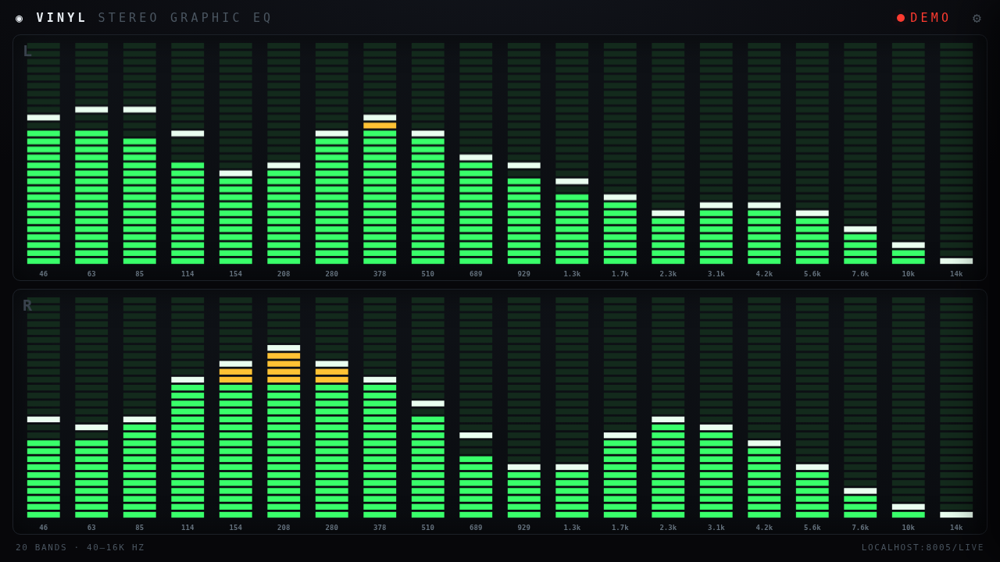

# Vinyl EQ

A retro **stereo graphic-EQ** visualizer for a live audio stream — segmented LED bars,
per-channel (L/R), green→amber→red with slow retro peak-hold caps. Pure HTML/JS/Canvas
(Web Audio API), no build step, no dependencies. Made to sit on a little display next to
a turntable, but it'll visualize *any* Icecast/HTTP audio stream.



*(preview rendered with `?demo`, a synthetic spectrum — the real thing reacts to your stream)*

## Quick start

```bash
python3 serve.py                 # serves this folder on http://0.0.0.0:8080/
python3 serve.py --port 9000     # any port you like
VINYL_EQ_PORT=9000 python3 serve.py
```

Then open `http://<host>:<port>/`.

Point it at your stream with the `?stream=` query param, or edit the default in
`index.html`:

```
http://<host>:<port>/?stream=http://your-icecast-host:8005/live
```

### CORS (important)
Because the page is served from its **own origin** (not the stream's), the audio server
must allow cross-origin reads or the analyser can't see the audio. For **Icecast**, add a
global header and restart:

```xml
<http-headers>
    <header name="Access-Control-Allow-Origin" value="*" />
</http-headers>
```

## Settings (⚙ gear, top-right)
Everything's live and saved to the browser (localStorage):

- **Bands** and **Segments** — resolution of the display
- **Sensitivity (hot ↔ calm)** — input dB ceiling. Turn it *up* if your setup pushes
  quieter than a hot vinyl feed; *down* if it's pegging.
- **Treble tilt** — lifts the highs to offset music's natural HF roll-off
- **Low / High cutoff** — analysed frequency range
- **Smoothing** and **Bar fall speed** — how liquid vs snappy the bars are
- **Peak hold** on/off, **hold time**, **fall speed** — the retro floating caps
- **Frequency labels** on/off, **color split points**, and **all five colors**
- **Reset defaults**

## Kiosk / auto-display
It auto-starts on load (no click). For an unattended Pi display, launch Chromium with:

```bash
chromium-browser --kiosk --autoplay-policy=no-user-gesture-required \
  "http://localhost:8080/"
```

## Run at boot (systemd)
See `vinyl-eq.service` — set `VINYL_EQ_PORT`, copy to `/etc/systemd/system/`, then
`sudo systemctl enable --now vinyl-eq`.

## TODO / roadmap
- **Interactive touch EQ.** Right now this *visualizes* audio (it reads a stream and
  analyses it) — it does **not** process/shape the sound. A true touch-and-drag graphic EQ,
  where sliding a band actually boosts/cuts that frequency, needs the audio to pass
  *through* this device. That becomes feasible once there's a real DAC / audio-processing
  path on the Pi (e.g. line-in → ALSA/BiquadFilter EQ chain → line-out). At that point the
  bars become draggable faders driving a filter bank. Deferred until the hardware's there.
- Optional mirror layout (L grows up / R grows down from a center line).
- Presets (save/name multiple config profiles).
